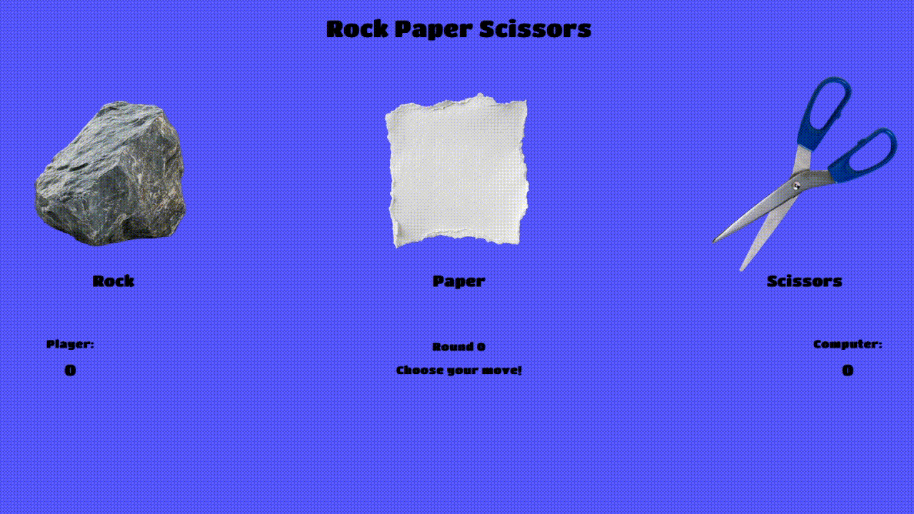

# Project: Rock Paper Scissors | The Odin Project
 
O objetivo deste projeto foi desenvolver o jogo Pedra, Papel ou Tesoura utilizando JavaScript, HTML e CSS.

O site permite ao utilizador escolher entre Rock, Paper ou Scissors e jogar contra o computador, apresentando o resultado de cada ronda e a pontuação atual diretamente na página.

Este projeto faz parte do percurso Foundations do The Odin Project e teve como principal objetivo consolidar os conhecimentos adquiridos em JavaScript, começando pela implementação da lógica do jogo e, posteriormente, pela criação de uma interface gráfica interativa.

Durante o desenvolvimento, foram aplicados conceitos como a manipulação do DOM, funções em JavaScript, event listeners, gestão de eventos, variáveis de estado, geração de escolhas aleatórias e atualização dinâmica do conteúdo da página.

## Podes visualizar o projeto aqui:
https://rafaelribeiro2003.github.io/Project-Rock-Paper-Scissors-theodinproject/

## Screenshot:

## Créditos: 
Este projeto foi desenvolvido como parte do currículo do **The Odin Project**.

---
## 🇬🇧 English

The goal of this project was to develop the Rock Paper Scissors game using JavaScript, HTML, and CSS.

The website allows the user to choose between Rock, Paper, or Scissors and play against the computer, displaying the result of each round and the current score directly on the page.

This project is part of The Odin Project's Foundations course and its main objective was to consolidate the JavaScript knowledge acquired throughout the course, starting with the implementation of the game's logic and later creating an interactive graphical interface.

During development, concepts such as DOM manipulation, JavaScript functions, event listeners, event handling, state variables, random choice generation, and dynamic page content updates were applied.

## Live Demo
https://rafaelribeiro2003.github.io/Project-Rock-Paper-Scissors-theodinproject/

## Screenshot

## Credits
This project was completed as part of **The Odin Project** curriculum.
